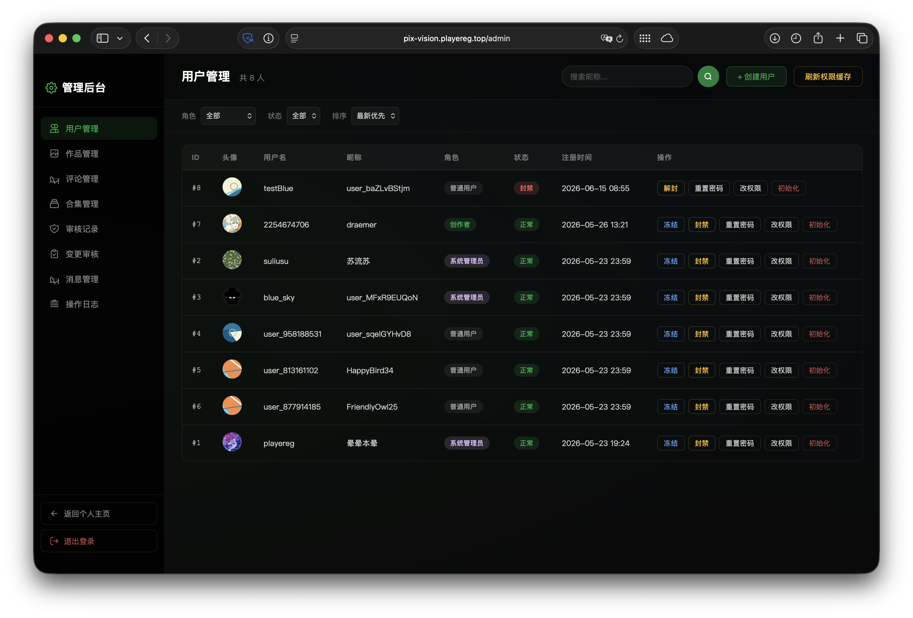
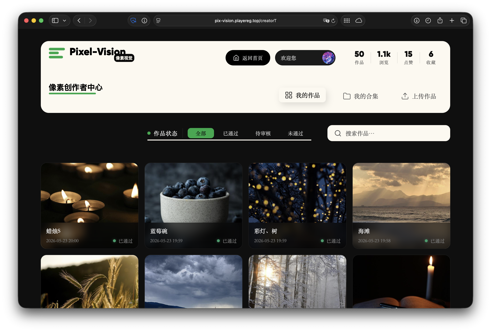
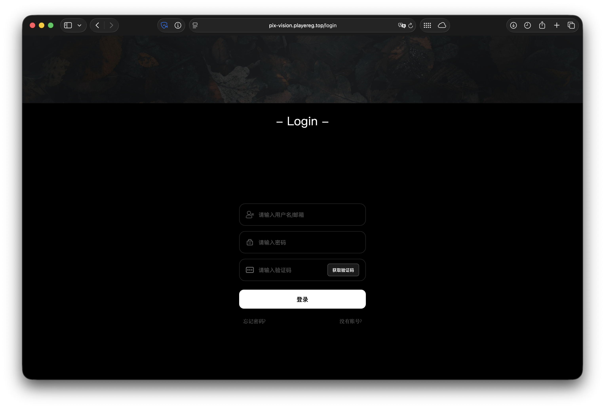

<div align="center">

[](README.md) [](README_CN.md)

</div>

# PixVision | 像素视觉

> A full-stack digital art creation and sharing platform built with Vue 3, Spring Boot 3, and FastAPI, featuring AI-powered content moderation, real-time messaging, and multi-module architecture.

[]()
[]()
[]()
[]()
[]()
[]()
[]()
[]()


---

## Tech Stack

| Layer | Technology | Version | Description |
|-------|------------|---------|-------------|
| Frontend Framework | Vue 3 (Composition API) | 3.5 | Core UI framework with `<script setup>` |
| Build Tool | Vite | 7.3 | Dev server & production bundler |
| State Management | Pinia | 3.0 | Centralized state store |
| Routing | Vue Router | 5.0 | SPA route management |
| Animation Engine | GSAP | 3.14 | ScrollTrigger, stagger animations |
| Carousel | Swiper | 12.1 | Touch slider component |
| CSS Preprocessor | Sass | 1.98 | SCSS styling |
| Backend Framework | Spring Boot | 3.3 | RESTful API server |
| Security | Spring Security + JWT | — | Stateless token authentication |
| ORM | Spring Data JPA / Hibernate | — | Database access layer |
| Auxiliary Service | FastAPI | 0.136+ | AI moderation & account detection |
| AI Integration | OpenAI SDK | 1.3+ | LLM-powered content audit |
| Database | MySQL | 8.0+ | Primary data storage |
| Cache | Redis | 7+ | Session cache & rate limiting |
| HTTP Client | httpx | 0.28+ | Async HTTP for Python service |

---

## Quick Start

### Prerequisites

- **Git** (with submodule support)
- **JDK 17+** + **MySQL 8.0+** + **Node.js 20+** + **Python 3.14+** + **Redis 7+**

### Clone Project

```bash
# Clone with submodules
git clone --recurse-submodules https://github.com/Abyss-PlayerEG/PixVision.git

# Or initialize submodules after cloning
git submodule update --init --recursive
```

### Configuration

All configurations are stored in `~/.pix_vision/` (Linux/Mac) or `%USERPROFILE%\.pix_vision\` (Windows).

```
~/.pix_vision/
├── application.yml          # Spring Boot config
├── python-server-conf.json  # FastAPI AI service config
├── config/                  # Other configs
├── data/                    # Data storage
├── key/                     # Key files
└── log/                     # Log files
```

#### Spring Boot Backend (`application.yml`)

```yaml
server:
  port: 1899

cors:
  allowed-origin: "*"  # Use * for dev, specific domain for production

spring:
  datasource:
    url: jdbc:mysql://<host>:3306/db_pix_vision?allowPublicKeyRetrieval=true&useSSL=false
    username: <username>
    password: <password>
  data:
    redis:
      host: localhost
      port: 6379
      timeout: 5000
      database: 0
  mail:
    host: smtp-relay.brevo.com
    port: 587
    from: bot@bot.playereg.top
    username: <smtp-username>
    password: <smtp-password>

mu-ying-secure:
  jwt-secret: <generate-with-openssl>
  salt: <custom-salt>
```

#### FastAPI AI Service (`python-server-conf.json`)

```json
{
  "ai": {
    "api_key": "sk-xxx",
    "model": "deepseek-v4-flash",
    "base_url": "https://api.deepseek.com",
    "timeout": 3
  },
  "bilibili": {
    "SESSDATA": "optional"
  }
}
```

| Field | Description |
|-------|-------------|
| `ai.api_key` | DeepSeek/OpenAI API Key |
| `ai.model` | Model name |
| `ai.base_url` | API endpoint URL |
| `bilibili.SESSDATA` | Bilibili login token (optional) |

#### Frontend Config

See `PixVisionPage/config/` directory after submodule init.

### Development Mode

```bash
# Terminal 1: Start Backend (Spring Boot)
cd PixVisionServer && mvn spring-boot:run

# Terminal 2: Start Frontend (Vite dev server)
cd PixVisionPage && pnpm install && pnpm dev

# Terminal 3: Start AI Service (FastAPI)
cd PixVisionPyServer && uv run python -m app.main
```

---

## Screenshots

| Home | Creation Tools | Gallery |
|:----:|:--------:|:--------:|
|  |  |  |

| User Profile | More Content | Chat |
|:--------:|:--------:|:----------:|
|  |  |  |

| Admin Panel | Creation Center | Authentication |
|:--------:|:--------:|:--------:|
|  |  |  |

---

## Author

- **PlayerEG** — gaster@vip.playereg.top
- Contributors: blue_sky_ks, suliusu

## License

This project is open-sourced under the [MIT License](LICENSE).

(c) 2025 PixVision. All Rights Reserved.
