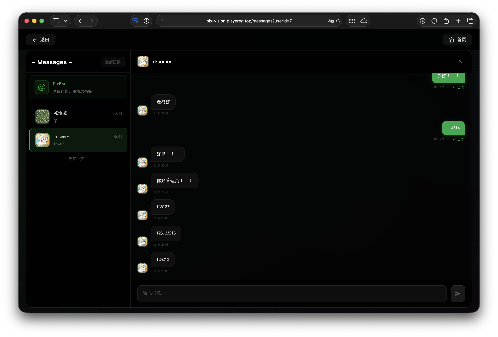

# PixVision

**像素视觉** — 数字艺术创作与分享平台

[](https://vuejs.org/)
[](https://spring.io/projects/spring-boot)
[](https://fastapi.tiangolo.com/)
[](LICENSE)

---

## 界面预览

| 首页 | 创作工具 | 首页画廊 |
|:----:|:--------:|:--------:|
|  |  |  |

| 用户主页 | 更多内容 | 聊天私信 |
|:--------:|:--------:|:----------:|
|  |  |  |

| 管理员端 | 创作中心 |
|:--------:|:--------:|
|  |  |

---

## 项目结构

本项目采用 Git Submodules 组织，包含以下子模块：

| 模块 | 说明 | 技术栈 |
|------|------|--------|
| [PixVisionServer](PixVisionServer) | 后端服务 | Java 17 / Spring Boot 3.3 |
| [PixVisionPyServer](PixVisionPyServer) | 辅助服务 | Python 3.14 / FastAPI |
| [PixVisionPage](PixVisionPage) | 前端应用 | Vue 3 / Vite 7 / GSAP |

## 快速开始

```bash
# 克隆项目（含子模块）
git clone --recurse-submodules https://github.com/Abyss-PlayerEG/PixVision.git

# 或者已克隆后初始化子模块
git submodule update --init --recursive
```

## 作者

- PlayerEG — gaster@vip.playereg.top
- 贡献者：blue_sky_ks

## 许可证

本项目基于 MIT 许可证开源。
